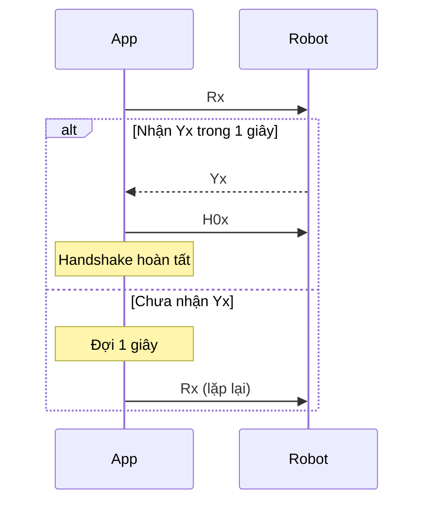
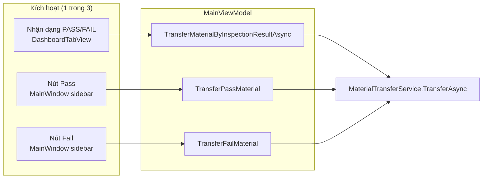
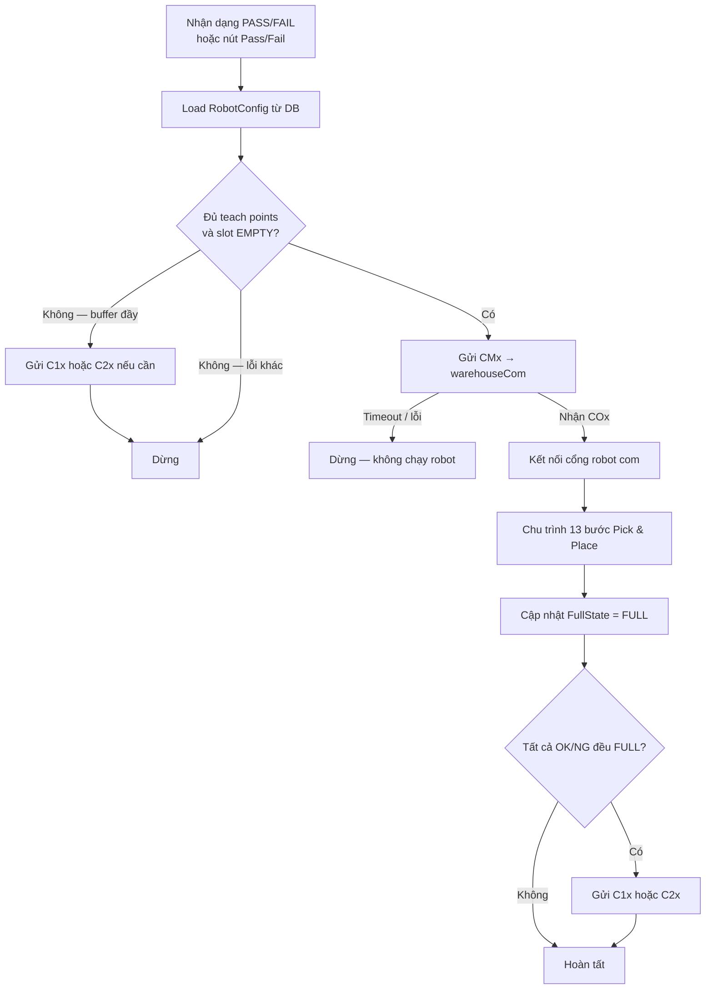
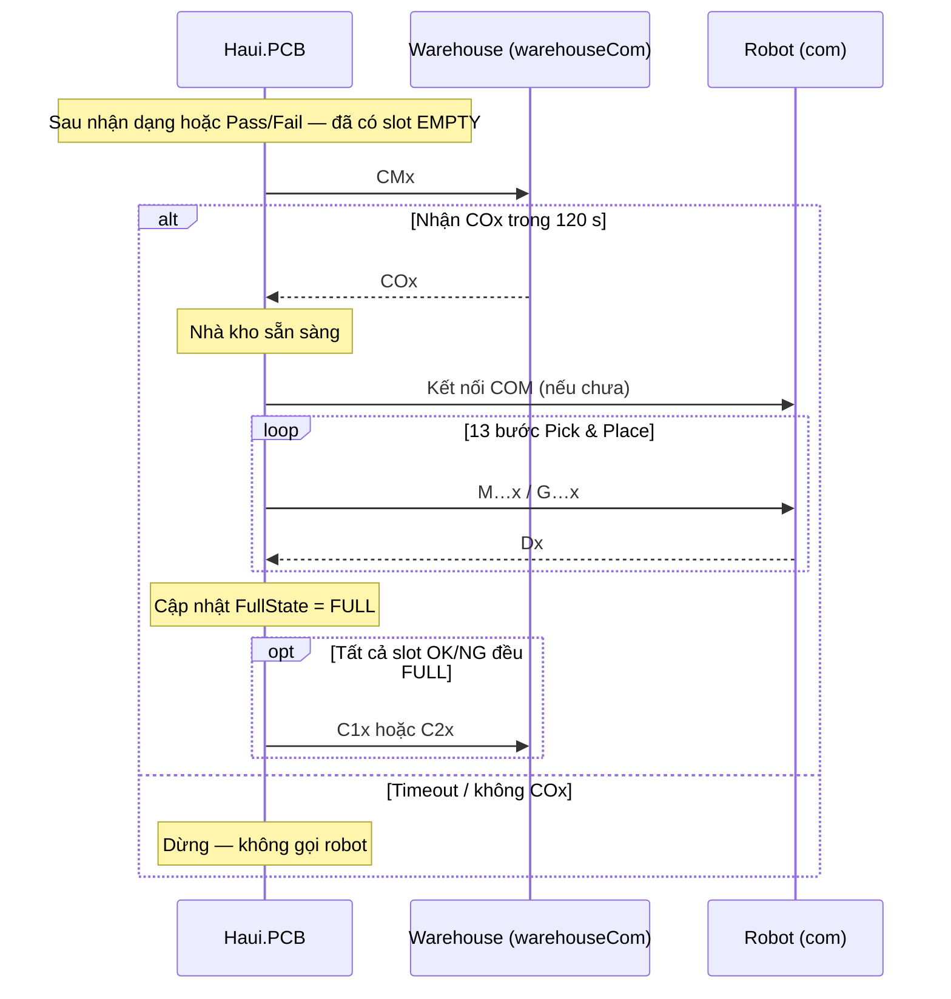
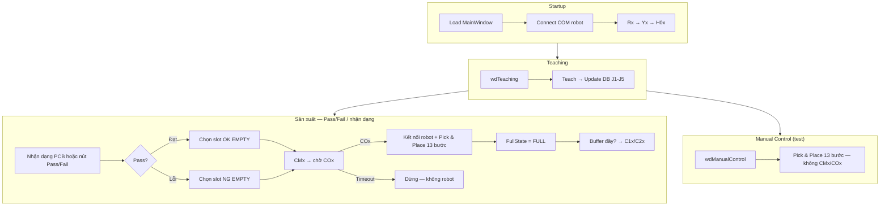

# Tài liệu luồng hoạt động Robot — Haui.PCB

Tài liệu mô tả các luồng điều khiển robot 5 khớp RRRRR + gripper trong hệ thống Pick & Place PCB, giao tiếp qua SerialPort và lưu cấu hình vị trí trên SQL Server.

---

## 1. Tổng quan hệ thống

| Thành phần | Mô tả |
|------------|--------|
| **Robot** | Cánh tay 5 DOF (J1–J5) + gripper, firmware nhận lệnh ASCII qua COM |
| **Warehouse** | Thiết bị/PLC phụ trên cổng `warehouseCom` — CMx/COx trước khi robot gắp; C1/C2 khi buffer đầy |
| **SQL Server** | Bảng `RobotConfig` — lưu tọa độ teach và trạng thái slot (`EMPTY` / `FULL`) |
| **Ứng dụng** | WPF `Haui.PCB` — MainWindow, Robot Teaching, Manual Control |

### Kiến trúc phần mềm

```
┌─────────────────────────────────────────────────────────────┐
│  UI (WPF)                                                    │
│  MainWindow · wdTeaching · wdManualControl                   │
└──────────────────────────┬──────────────────────────────────┘
                           │
┌──────────────────────────▼──────────────────────────────────┐
│  Processing (Haui.PCB)                                       │
│  RobotSerialService · RobotPickPlaceExecutor                 │
│  MaterialTransferService · WarehouseSerialService            │
│  RobotStartupHandshakeService                                │
│  RobotConfigService (adapter)                                │
└──────────────────────────┬──────────────────────────────────┘
                           │
┌──────────────────────────▼──────────────────────────────────┐
│  BL.PCBDetect — RobotConfigBL                                │
└──────────────────────────┬──────────────────────────────────┘
                           │
┌──────────────────────────▼──────────────────────────────────┐
│  DL.PCBDetect — RobotConfigRepository                        │
│  Stored Procedures trên SQL Server                           │
└─────────────────────────────────────────────────────────────┘
```

---

## 2. Cấu hình (`Config/setting.json`)

| Khóa | Ý nghĩa | Ví dụ |
|------|---------|-------|
| `com` | Cổng COM robot | `COM20` |
| `warehouseCom` | Cổng COM warehouse | `COM22` |
| `baudRate` | Tốc độ truyền (robot + warehouse) | `115200` |
| `stepsPerDeg` | Bước motor / 1 độ | `100` |
| `jogStepDegrees` | Bước jog trên màn Teaching | `15` |
| `speedPercent` | Tốc độ Go To (0–100%) | `31` |
| `waitPointJoint234OffsetDegrees` | Offset J2/J3/J4 cho Wait PickUp, Wait OK, Wait NG (độ) | `-20` |
| `DatabaseConnection` | Chuỗi kết nối SQL Server | `SmartWarehouse` |

**Lưu ý:** Cần `TrustServerCertificate=True` nếu SQL Express dùng chứng chỉ tự ký.

---

## 3. Giao thức Serial robot

Mọi lệnh ASCII gửi qua `SendAscii(cmd)` được firmware nhận dạng **`{cmd}x`** (thêm hậu tố `x`).

| Lệnh gửi | Ý nghĩa |
|----------|---------|
| `Rx` | Handshake khởi động — hỏi robot sẵn sàng |
| `Yx` | Robot phản hồi sẵn sàng (nhận) |
| `H0x` | Homing tất cả trục (3→2→1→4→5) |
| `H1x` … `H5x` | Homing một trục |
| `Mj1,j2,j3,j4,j5x` | Di chuyển tới tọa độ 5 khớp (độ) |
| `J1+10x`, `JG-5x` | Jog từng trục / gripper |
| `G90x`, `G0x` | Mở / đóng gripper (góc độ) |
| `Dx` | Robot báo **hoàn thành** bước di chuyển (nhận) |

### Phản hồi homing

| Nhận | Ý nghĩa |
|------|---------|
| `Ax` | Bắt đầu homing trục |
| `Dx` | Hoàn thành homing / hoàn thành lệnh move |

### Lệnh warehouse (cổng `warehouseCom`)

| Lệnh | Ý nghĩa |
|------|---------|
| `CMx` | PC yêu cầu chuyển material (trước khi robot gắp) |
| `COx` | Nhà kho xác nhận sẵn sàng — PC mới chạy robot |
| `C1x` | Tất cả slot **OK1–OK4** có `FullState = FULL` |
| `C2x` | Tất cả slot **NG1–NG4** có `FullState = FULL` |

---

## 4. Danh sách vị trí teach chuẩn

| Nhóm | Tên vị trí | Vai trò |
|------|------------|---------|
| Chung | `PickUp` | Điểm gắp PCB |
| Chung | `Wait PickUp` | Chờ trước/sau gắp — lưu DB, teach được (seed: PickUp + offset J2–J4 từ cài đặt) |
| Chung | `Wait` | Hành lang giữa pick và place — lưu DB, teach được |
| Chung | `Wait OK` | Chờ trước/sau đặt **Pass** — lưu DB (seed: OK1 + offset J2–J4) |
| Chung | `Wait NG` | Chờ trước/sau đặt **Fail** — lưu DB (seed: NG1 + offset J2–J4) |
| OK | `OK1` … `OK4` | Buffer hàng **Pass** |
| NG | `NG1` … `NG4` | Buffer hàng **Fail** |

Teach **PickUp** → tự offset và lưu **Wait PickUp**; teach **OK1** → **Wait OK**; teach **NG1** → **Wait NG** (offset J2–J4 theo `waitPointJoint234OffsetDegrees`, mặc định −20°). **Wait** (hành lang) teach thủ công. Pass dùng **Wait OK** (bước 8, 11); Fail dùng **Wait NG**.

Tọa độ J1–J5 lưu trong bảng `RobotConfig`. Gripper chỉ dùng trên UI/Serial, **không** lưu Database.

---

## 5. Database — bảng `RobotConfig`

### Cấu trúc

| Cột | Kiểu | Mô tả |
|-----|------|--------|
| `ID` | UNIQUEIDENTIFIER | Khóa bản ghi |
| `PosName` | NVARCHAR | Tên vị trí (PickUp, OK1, …) |
| `PosGroup` | NVARCHAR | Chung / OK / NG |
| `J1` … `J5` | NVARCHAR | Góc khớp (chuỗi số) |
| `FullState` | NVARCHAR | `EMPTY` hoặc `FULL` (slot OK/NG) |
| `UpdateTime` | DATETIME | Thời điểm cập nhật |

### Stored Procedures

| SP | Mục đích |
|----|----------|
| `Get_RobotConfig_All` | Tải toàn bộ vị trí |
| `Get_RobotConfig_ByName` | Tải một vị trí theo tên |
| `Update_RobotConfig_TeachPoint` | Cập nhật J1–J5 khi teach |
| `Update_RobotConfig_FullState` | Đổi `FullState` slot (EMPTY ↔ FULL) |

Script SQL: thư mục `Database/` (`01` → `02` → `03`).

---

## 6. Luồng khởi động (MainWindow Load)

**Màn hình:** `MainWindow` — sự kiện `Window_Loaded`  
**Service:** `RobotStartupHandshakeService`



**Chi tiết:**
1. Kết nối cổng `com` từ `setting.json`.
2. Gửi `Rx`.
3. Chờ phản hồi bắt đầu bằng `Y` (tức `Yx`).
4. Nếu chưa nhận trong **1 giây** → gửi lại `Rx`.
5. Khi nhận `Yx` → gửi `H0x` (homing toàn bộ).
6. Chỉ chạy **một lần** mỗi phiên mở app (`IsCompleted`).

---

## 7. Luồng Teach vị trí (Robot Teaching)

**Màn hình:** `wdTeaching`  
**ViewModel:** `RobotTeachViewModel`


**Chi tiết:**
1. `ReloadTeachPoints()` — gọi `Get_RobotConfig_All` qua BL → DL.
2. Người dùng chọn vị trí (PickUp, OK1, …), chỉnh khớp trên UI hoặc jog qua Serial.
3. **Teach vị trí** — ghi J1–J5 của điểm đang chọn vào Database (không đổi `FullState`).
4. **Lưu cấu hình** — ghi `jogStepDegrees`, `speedPercent`, `waitPointJoint234OffsetDegrees`, COM… vào `setting.json`.
5. Nếu Database lỗi → hiển thị thông báo trên thanh trạng thái (không fallback file JSON).

---

## 8. Luồng Manual Control

**Màn hình:** `wdManualControl`  
**ViewModel:** `ManualControlViewModel`  
**Executor:** `RobotPickPlaceExecutor`

Dùng để **test thủ công** chu trình gắp–đặt tới một slot OK hoặc NG do người dùng chọn.

### Chu trình 13 bước (mỗi bước chờ `Dx`)

| Bước | Hành động |
|------|-----------|
| 1/13 | Move → **Wait** (không H0x) |
| 2/13 | `G90x` — Mở gripper |
| 3/13 | Move → **Wait PickUp** |
| 4/13 | Move → **PickUp** |
| 5/13 | `G0x` — Đóng gripper (gắp) |
| 6/13 | Move → **Wait PickUp** (rút lui) |
| 7/13 | Move → **Wait** |
| 8/13 | Move → **Wait OK** hoặc **Wait NG** (theo đích) |
| 9/13 | Move → **OKx / NGx** (Place) |
| 10/13 | `G90x` — Mở gripper (thả) |
| 11/13 | Move → **Wait OK/NG** (rút lui) |
| 12/13 | Move → **Wait** |
| 13/13 | `G0x` — Đóng gripper |

**Wait PickUp** / **Wait OK** / **Wait NG** / **Wait** — đều từ Database (teach được).

- Timeout mỗi bước: **120 giây**.
- Manual Control **không** cập nhật `FullState` trong Database.

---

## 9. Luồng Pass / Fail material (MainWindow)

**Service:** `MaterialTransferService` → `MainViewModel`  
**Warehouse:** `WarehouseSerialService` (CMx/COx, C1x/C2x)

Cả **nhận dạng tự động** và **nút Pass/Fail** đều hội tụ vào **một** hàm `MaterialTransferService.TransferAsync` — đảm bảo luôn gửi CMx và chờ COx trước khi chạy cánh tay robot.

### 9.1. Ba điểm kích hoạt



| Nguồn | File / sự kiện | Gọi tới |
|-------|----------------|---------|
| Nhận dạng PASS | `TestPipelineViewModel.InspectionCompleted` → `DashboardTabView` → `MainWindow.HandleInspectionCompletedAsync` | `TransferMaterialByInspectionResultAsync(true)` |
| Nhận dạng FAIL | Cùng chuỗi trên | `TransferMaterialByInspectionResultAsync(false)` |
| Nút **Pass** | `MainWindow.btnPass_Click` | `TransferPassMaterial()` |
| Nút **Fail** | `MainWindow.btnFail_Click` | `TransferFailMaterial()` |

**Manual Control** (`wdManualControl`) **không** đi qua luồng này — chỉ test robot thủ công, không gửi CMx/COx.

### 9.2. Chọn slot đích

| Nút / kết quả | Nhóm slot | Quy tắc chọn |
|---------------|-----------|--------------|
| **Pass** / nhận dạng PASS | OK1–OK4 | Slot **đầu tiên** có `FullState = EMPTY` |
| **Fail** / nhận dạng FAIL | NG1–NG4 | Slot **đầu tiên** có `FullState = EMPTY` |

Nếu tất cả slot nhóm đó đã `FULL` → **không** gửi CMx, không chạy robot; chỉ gửi C1x/C2x nếu buffer đầy (mục 9.4) và báo lỗi.

### 9.3. Sơ đồ luồng xử lý (chi tiết)

```
┌─────────────────────────────────────────────────────────────┐
│  KÍCH HOẠT: nhận dạng PASS/FAIL · nút Pass · nút Fail      │
└──────────────────────────┬──────────────────────────────────┘
                           ▼
              MaterialTransferService.TransferAsync
                           │
         ┌─────────────────┼─────────────────┐
         ▼                 ▼                 ▼
    Kiểm tra DB      Tìm slot EMPTY    Kiểm tra teach points
    (PickUp, Wait,   (OK1–4 / NG1–4)  (Wait PickUp, Wait OK/NG)
     Wait OK/NG…)         │                 │
         └─────────────────┴─────────────────┘
                           │
              ┌────────────┴────────────┐
              │  Còn slot EMPTY?        │
              └────────────┬────────────┘
                    Không  │  Có
              ┌────────────┴────────────┐
              ▼                         ▼
    Gửi C1x/C2x (buffer đầy)    Gửi CMx → warehouseCom
    Dừng — không chạy robot              │
                                         ▼
                              Chờ COx (timeout 120 s)
                                         │
                              ┌──────────┴──────────┐
                         Timeout/lỗi            Nhận COx
                              │                    │
                              ▼                    ▼
                    Dừng — không robot    Kết nối cổng robot (com)
                                                   │
                                                   ▼
                              Chu trình 13 bước (RobotPickPlaceExecutor)
                                                   │
                                                   ▼
                              Cập nhật FullState = FULL (slot vừa đặt)
                                                   │
                                                   ▼
                              Tất cả OK/NG FULL? → gửi C1x/C2x
```



**Thứ tự thực thi:**
1. Load vị trí từ Database — tính Wait PickUp / Wait OK hoặc NG.
2. **Gửi `CMx` → `warehouseCom`, chờ `COx`** (timeout 120 s). Chỉ khi nhận `COx` mới tiếp tục.
3. Kết nối robot COM (`com`) nếu chưa online.
4. Chạy **chu trình 13 bước** (`RobotPickPlaceExecutor`).
5. Gọi `Update_RobotConfig_FullState` → slot vừa đặt = **`FULL`**.
6. Nếu toàn bộ OK (hoặc NG) đều `FULL` → gửi `C1x` / `C2x`.

### 9.4. Handshake CMx / COx (sequence)



| Bước | Lệnh | Hướng | Ghi chú |
|------|------|-------|---------|
| 1 | `CMx` | PC → warehouse | Yêu cầu chuyển material |
| 2 | `COx` | warehouse → PC | **Bắt buộc** — mới được chạy robot |
| 3 | M/G + chờ `Dx` | PC ↔ robot | Chu trình 13 bước |
| 4 | `C1x` / `C2x` | PC → warehouse | Chỉ khi buffer đầy sau khi đặt hàng |

Gửi warehouse qua cổng riêng (`warehouseCom`), mở COM → gửi/nhận → đóng — **không** dùng chung cổng robot.

**DeveloperMode + VirtualSerialPort:** bỏ qua CMx/COx (coi như nhà kho OK) — chỉ dùng khi test không có thiết bị warehouse thật.

### 9.5. Báo warehouse buffer đầy

| Điều kiện | Lệnh gửi | Cổng |
|-----------|----------|------|
| OK1–OK4 đều `FULL` | `C1x` | `warehouseCom` |
| NG1–NG4 đều `FULL` | `C2x` | `warehouseCom` |

Xảy ra khi: (a) không còn slot trống trước khi chạy robot, hoặc (b) sau khi đặt hàng làm đầy toàn bộ buffer nhóm đó.

---

## 10. Sơ đồ tổng hợp vận hành



---

## 11. File mã nguồn liên quan

| File / thư mục | Vai trò |
|----------------|---------|
| `Haui.PCB/Processing/RobotSerialService.cs` | Gửi/nhận COM robot |
| `Haui.PCB/Processing/RobotSerialProtocol.cs` | Định dạng lệnh M/J/H/G/R/C |
| `Haui.PCB/Processing/RobotStartupHandshakeService.cs` | Handshake Rx/Yx/H0 |
| `Haui.PCB/Processing/RobotPickPlaceExecutor.cs` | Chu trình 13 bước + chờ Dx |
| `Haui.PCB/Processing/MaterialTransferService.cs` | Pass/Fail + FULL + warehouse |
| `Haui.PCB/Processing/WarehouseSerialService.cs` | CMx/COx handshake, C1x/C2x buffer đầy |
| `Haui.PCB/Processing/RobotConfigService.cs` | Adapter UI → BL |
| `BL.PCBDetect/RobotConfigBL.cs` | Nghiệp vụ RobotConfig |
| `DL.PCBDetect/RobotConfigRepository.cs` | Gọi Stored Procedure |
| `Haui.PCB/ViewModels/RobotTeachViewModel.cs` | Màn Teaching |
| `Haui.PCB/ViewModels/ManualControlViewModel.cs` | Màn Manual Control |
| `Haui.PCB/Models/RobotTeachPositions.cs` | Danh sách vị trí chuẩn |
| `Database/*.sql` | Schema, seed, stored procedures |

---

## 12. Xử lý lỗi thường gặp

| Triệu chứng | Nguyên nhân | Hướng xử lý |
|-------------|-------------|-------------|
| Không tải được Database | Sai connection string / SSL | Kiểm tra `DatabaseConnection`, thêm `TrustServerCertificate=True` |
| Handshake không xong | Robot chưa bật / sai COM | Kiểm tra `com`, xem log RX trên MainWindow |
| Timeout chờ Dx | Robot không phản hồi sau lệnh move | Kiểm tra firmware, dây Serial, nguồn robot |
| Tất cả slot FULL | Buffer đầy | Chờ warehouse xử lý (C1x/C2x đã gửi), reset `FullState` khi lấy hàng |
| Timeout chờ COx | Nhà kho không phản hồi sau CMx | Kiểm tra `warehouseCom`, firmware warehouse, dây Serial |
| Gửi C1x/C2x thất bại | Sai `warehouseCom` | Kiểm tra cổng COM22 và thiết bị warehouse |

---

## 13. Thứ tự triển khai Database (lần đầu)

```text
1. Database/01_RobotConfig_Schema.sql
2. Database/02_RobotConfig_SeedData.sql
3. Database/03_RobotConfig_StoredProcedures.sql
```

Chạy trên đúng database trong `DatabaseConnection` (ví dụ `SmartWarehouse`).

---

*Tài liệu đồng bộ với codebase Haui.PCB — cập nhật khi thay đổi luồng robot hoặc giao thức Serial.*
