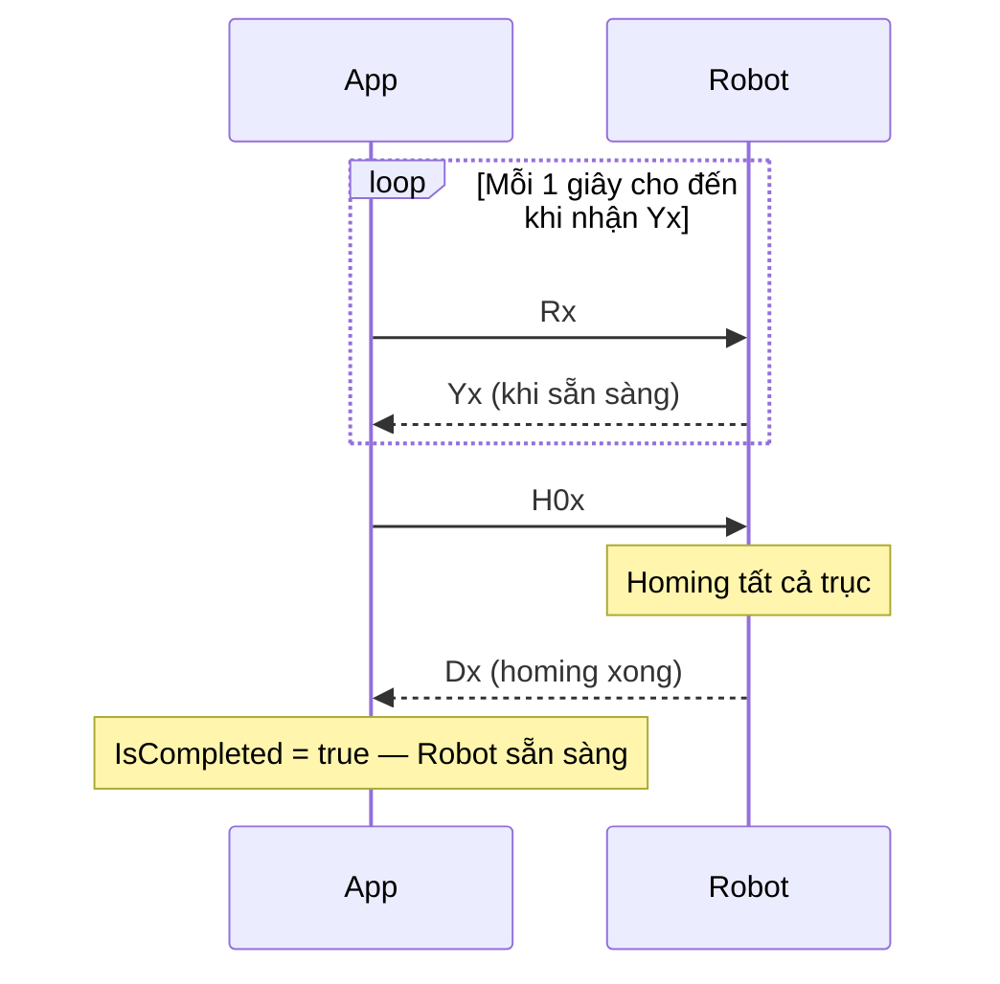
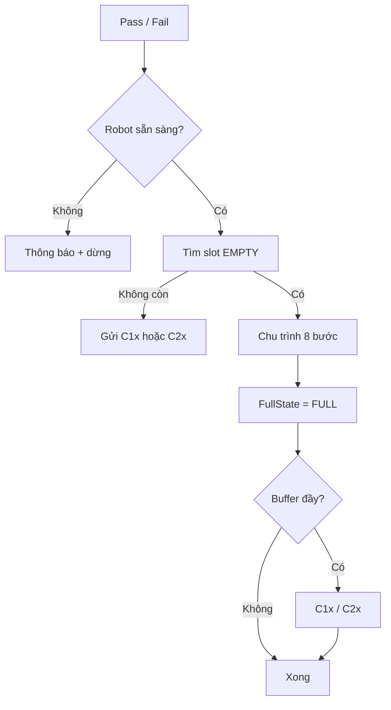

# Tài liệu hệ thống Robot — Haui.PCB

Tài liệu tổng hợp luồng điều khiển cánh tay robot 5 khớp RRRRR + gripper trong hệ thống Pick & Place PCB: giao tiếp Serial, Database, các màn hình và quy tắc an toàn thao tác.

---

## Mục lục

1. [Tổng quan](#1-tổng-quan)
2. [Cấu hình](#2-cấu-hình-settingjson)
3. [Giao thức Serial](#3-giao-thức-serial)
4. [Vị trí teach](#4-vị-trí-teach-chuẩn)
5. [Database](#5-database--bảng-robotconfig)
6. [Quản lý cổng COM](#6-quản-lý-cổng-com)
7. [Khởi động & kết nối robot](#7-khởi-động--kết-nối-robot)
8. [Điều kiện cho phép thao tác robot](#8-điều-kiện-cho-phép-thao-tác-robot)
9. [Màn hình Teaching](#9-màn-hình-teaching)
10. [Màn hình Manual Control](#10-màn-hình-manual-control)
11. [Luồng Pass / Fail (MainWindow)](#11-luồng-pass--fail-mainwindow)
12. [Warehouse buffer đầy](#12-warehouse-buffer-đầy)
13. [Sơ đồ tổng hợp](#13-sơ-đồ-tổng-hợp)
14. [File mã nguồn](#14-file-mã-nguồn)
15. [Xử lý lỗi](#15-xử-lý-lỗi-thường-gặp)
16. [Triển khai Database](#16-triển-khai-database)

---

## 1. Tổng quan

| Thành phần | Mô tả |
|------------|--------|
| **Robot** | Cánh tay 5 DOF (J1–J5) + gripper, firmware nhận lệnh ASCII qua COM |
| **Warehouse** | Thiết bị phụ trên cổng `warehouseCom`, nhận `C1x` / `C2x` khi buffer đầy |
| **SQL Server** | Bảng `RobotConfig` — tọa độ teach + trạng thái slot `EMPTY` / `FULL` |
| **Ứng dụng** | WPF `Haui.PCB` — MainWindow, Teaching, Manual Control |

### Kiến trúc phần mềm

```
┌─────────────────────────────────────────────────────────────┐
│  UI (WPF)                                                    │
│  MainWindow · RobotTeachingWindow · ManualControlWindow      │
└──────────────────────────┬──────────────────────────────────┘
                           │
┌──────────────────────────▼──────────────────────────────────┐
│  Processing (Haui.PCB)                                       │
│  RobotSerialService · RobotPickPlaceExecutor                 │
│  RobotStartupHandshakeService · RobotConnectionHelper        │
│  MaterialTransferService · RobotConfigService                │
└──────────────────────────┬──────────────────────────────────┘
                           │
┌──────────────────────────▼──────────────────────────────────┐
│  BL.PCBDetect — RobotConfigBL                                │
└──────────────────────────┬──────────────────────────────────┘
                           │
┌──────────────────────────▼──────────────────────────────────┐
│  DL.PCBDetect — RobotConfigRepository → Stored Procedures    │
└─────────────────────────────────────────────────────────────┘
```

---

## 2. Cấu hình (`Config/setting.json`)

| Khóa | Ý nghĩa | Ví dụ |
|------|---------|-------|
| `com` | Cổng COM robot | `COM20` |
| `warehouseCom` | Cổng COM warehouse | `COM22` |
| `baudRate` | Tốc độ truyền | `115200` |
| `stepsPerDeg` | Bước motor / 1° | `100` |
| `jogStepDegrees` | Bước jog (Teaching) | `15` |
| `speedPercent` | Tốc độ Go To (%) | `31` |
| `DatabaseConnection` | Chuỗi SQL Server | `SmartWarehouse` |

**Lưu ý:** Thêm `TrustServerCertificate=True` nếu SQL dùng chứng chỉ tự ký.

**Phân tách lưu trữ:**

| Dữ liệu | Lưu ở đâu |
|---------|-----------|
| Tọa độ teach J1–J5, FullState slot | SQL Server `RobotConfig` |
| COM, baud, jog, speed | `setting.json` |
| Gripper | Chỉ UI/Serial, **không** lưu DB |

---

## 3. Giao thức Serial

Mọi lệnh gửi qua `SendAscii(cmd)` thành **`{cmd}x`** trên dây.

### Lệnh điều khiển robot

| Lệnh | Ý nghĩa |
|------|---------|
| `Rx` | Handshake — hỏi robot sẵn sàng |
| `Yx` | Robot phản hồi sẵn sàng (**nhận**) |
| `H0x` | Homing tất cả trục (firmware) |
| `H1x` … `H5x` | Homing một trục |
| `Mj1,j2,j3,j4,j5x` | Move tới tọa độ 5 khớp (độ) |
| `J1+10x`, `JG-5x` | Jog trục / gripper |
| `G90x`, `G0x` | Mở / đóng gripper |
| `Dx` | Robot báo **hoàn thành** lệnh (**nhận**) |

### Phản hồi homing

| Nhận | Ý nghĩa |
|------|---------|
| `Ax` | Bắt đầu homing trục |
| `Dx` | Hoàn thành homing / move |

### Lệnh warehouse (`warehouseCom`)

| Lệnh | Điều kiện |
|------|-----------|
| `C1x` | Tất cả **OK1–OK4** = `FULL` |
| `C2x` | Tất cả **NG1–NG4** = `FULL` |

---

## 4. Vị trí teach chuẩn

| Nhóm | Tên | Vai trò |
|------|-----|---------|
| Chung | `PickUp` | Điểm gắp PCB |
| Chung | `Wait` | Điểm chờ trung gian |
| OK | `OK1` … `OK4` | Buffer **Pass** |
| NG | `NG1` … `NG4` | Buffer **Fail** |

**Không có điểm teach `Home`.** Về home dùng lệnh firmware **`H0x`** (homing), không dùng tọa độ teach.

Bản ghi `Home` cũ trong DB (nếu có) được loại bỏ — chạy lại seed SQL hoặc:

```sql
DELETE FROM RobotConfig WHERE PosName = N'Home';
```

---

## 5. Database — bảng `RobotConfig`

### Cấu trúc

| Cột | Kiểu | Mô tả |
|-----|------|--------|
| `ID` | UNIQUEIDENTIFIER | Khóa |
| `PosName` | NVARCHAR | PickUp, Wait, OK1, … |
| `PosGroup` | NVARCHAR | Chung / OK / NG |
| `J1` … `J5` | NVARCHAR | Góc khớp |
| `FullState` | NVARCHAR | `EMPTY` hoặc `FULL` |
| `UpdateTime` | DATETIME | Cập nhật |

### Stored Procedures

| SP | Mục đích |
|----|----------|
| `Get_RobotConfig_All` | Tải toàn bộ vị trí |
| `Get_RobotConfig_ByName` | Tải một vị trí |
| `Update_RobotConfig_TeachPoint` | Cập nhật J1–J5 khi teach |
| `Update_RobotConfig_FullState` | Đổi `FullState` sau Pass/Fail |

Script: `Database/01` → `02` → `03` (chạy trên đúng catalog trong `DatabaseConnection`).

---

## 6. Quản lý cổng COM

`MainWindow` tạo **một** `RobotSerialService` dùng chung suốt phiên app.

```
Mở app (MainWindow)  →  Mở COM robot, giữ kết nối
Mở Teaching / Manual →  Dùng chung _serialService (không mở/đóng COM riêng)
Đóng Teaching/Manual →  Release ViewModel, COM vẫn mở
Thoát app            →  _serialService.Dispose() — đóng COM
```

---

## 7. Khởi động & kết nối robot

**Service:** `RobotStartupHandshakeService`  
**Kích hoạt:** `MainWindow.Window_Loaded`

### Luồng đầy đủ



| Bước | Hành động |
|------|-----------|
| 1 | Mở cổng `com` từ `setting.json` |
| 2 | Gửi `Rx`, chờ `Yx` (lặp mỗi **1 giây** nếu chưa nhận) |
| 3 | Nhận `Yx` → gửi `H0x` |
| 4 | Chờ `Dx` (timeout **120 giây**) |
| 5 | Nhận `Dx` → `IsCompleted = true` |

**Chỉ sau bước 5** robot được coi là sẵn sàng thao tác.

### Trạng thái hiển thị MainWindow

| Trạng thái | Text | Màu |
|------------|------|-----|
| COM offline | `● Robot Offline` | Đỏ |
| Đang kết nối / homing | `● Robot COMxx — Đang homing` | Vàng |
| Chưa hoàn tất | `● Robot COMxx — Chưa sẵn sàng` | Đỏ |
| Sẵn sàng | `● Robot COMxx — Sẵn sàng` | Xanh |

---

## 8. Điều kiện cho phép thao tác robot

<<<<<<< HEAD
**Điều kiện:** `RobotConnectionHelper.IsRobotArmReady` = COM online **và** `handshake.IsCompleted`.
=======
**Màn hình:** `RobotTeachingWindow` (hoặc tab `RobotTeachingTabView` trong MainWindow)  
**ViewModel:** `RobotTeachViewModel`
>>>>>>> develop

### Các thao tác bị khóa khi chưa sẵn sàng

| Thao tác | Hành vi |
|----------|---------|
| Mở **Teaching** | Nút disable + MessageBox nếu bấm |
| Mở **Manual Control** | Tương tự |
| **Pass / Fail** | Nút disable + kiểm tra trước khi chạy |

### Thông báo

**Đang kết nối / homing** (*Robot chưa sẵn sàng*):

> Robot đang kết nối hoặc thực hiện homing.
>
> Vui lòng đợi homing hoàn tất rồi thực hiện thao tác.

**Chưa kết nối** (*Chưa kết nối robot*):

> Cánh tay robot chưa sẵn sàng.
>
> Kiểm tra:
> • Robot đã bật nguồn
> • Cổng COM đúng trong file cấu hình
> • Dây kết nối ổn định
>
> Đợi màn hình chính báo "Robot sẵn sàng" rồi thử lại.

---

## 9. Màn hình Teaching

<<<<<<< HEAD
**File:** `wdTeaching` · `RobotTeachViewModel`
=======
**Màn hình:** `ManualControlWindow` (hoặc tab `ManualControlTabView` trong MainWindow)  
**ViewModel:** `ManualControlViewModel`  
**Executor:** `RobotPickPlaceExecutor`
>>>>>>> develop

### Load & lưu dữ liệu

1. `ReloadTeachPoints()` — tải từ DB qua BL/DL (`Get_RobotConfig_All`).
2. Không hiển thị bản ghi `Home` (nếu còn trong DB).
3. **Teach vị trí** — lưu J1–J5 qua `Update_RobotConfig_TeachPoint`.
4. **Lưu cấu hình** — jog, speed, COM → `setting.json`.

### Chờ Dx & khóa nút

Sau mỗi lệnh **jog / move / gripper / homing / Go To**:

- `IsAwaitingRobotDone = true` → khóa nút điều khiển.
- Nhận `Dx` → mở lại nút.
- Timeout: **120 giây**.

| Thuộc tính | Ý nghĩa |
|------------|---------|
| `CanAdjustJoints` | Cho phép jog/slider (khóa khi chờ Dx) |
| `CanOperateRobot` | Cần Serial + không chờ Dx |
| `CanCloseWindow` | Cho phép nút Đóng |

### Đóng màn hình Teaching

| Tình huống | Hành vi |
|------------|---------|
| Đang chờ Dx | **Không** cho đóng — MessageBox *"Không thể đóng"* |
| Robot rảnh | Gửi **`H0x`** → chờ **Dx** → đóng màn hình |
| Đang homing lúc đóng | Nút Đóng bị disable |

**Thông báo khi đóng lúc đang chạy lệnh:**

> Robot đang thực hiện lệnh.
>
> Vui lòng đợi robot dừng hẳn rồi mới đóng màn hình.

---

## 10. Màn hình Manual Control

**File:** `wdManualControl` · `ManualControlViewModel`

### Chức năng

- Chọn vị trí **OK / NG** trong bảng.
- **Chạy test** — chu trình Pick & Place 8 bước (có chờ Dx).
- **Tới PickUp** / **Tới vị trí đích** — move đơn, chờ Dx.

### Khóa nút theo trạng thái

| Nút / control | Điều kiện enable |
|---------------|------------------|
| **Tới vị trí đích** | Đã chọn đích + Serial + không đang chạy lệnh |
| **Tới PickUp** | Serial + không đang chạy lệnh |
| **Chạy test** | Đã chọn đích + Serial + không đang chạy lệnh |
| Tải lại teach, bảng OK/NG, COM | `CanOperateControls` |
| **Đóng** | `CanCloseWindow` |

`CanOperateControls` = false khi: test đang chạy, đang chờ Dx, đang homing H0 lúc đóng.

### Chu trình test 8 bước

| Bước | Hành động |
|------|-----------|
| 1/8 | `G90x` — Mở gripper |
| 2/8 | Move → **PickUp** |
| 3/8 | `G0x` — Đóng gripper |
| 4/8 | Move → **Wait** |
| 5/8 | Move → **OKx / NGx** |
| 6/8 | `G90x` — Mở gripper |
| 7/8 | Move → **Wait** |
| 8/8 | `G0x` — Đóng gripper |

- Timeout mỗi bước: **120 giây**.
- **Không** cập nhật `FullState` trong DB.

### Đóng màn hình

Giống Teaching: chặn khi đang chạy lệnh; khi rảnh → `H0x` → chờ `Dx` → đóng.

---

## 11. Luồng Pass / Fail (MainWindow)

**Service:** `MaterialTransferService`

### Chọn slot

| Nút | Quy tắc |
|-----|---------|
| **Pass** | Slot OK **đầu tiên** có `FullState = EMPTY` |
| **Fail** | Slot NG **đầu tiên** có `FullState = EMPTY` |

### Chu trình



1. Kiểm tra robot sẵn sàng (`IsCompleted`).
2. Chạy chu trình 8 bước (`RobotPickPlaceExecutor`).
3. `Update_RobotConfig_FullState` → slot vừa đặt = **`FULL`**.
4. Nếu toàn bộ OK (hoặc NG) đều `FULL` → gửi warehouse.

---

## 12. Warehouse buffer đầy

| Điều kiện | Lệnh | Cổng |
|-----------|------|------|
| OK1–OK4 đều `FULL` | `C1x` | `warehouseCom` |
| NG1–NG4 đều `FULL` | `C2x` | `warehouseCom` |

Mở COM riêng → gửi → đóng (không dùng chung cổng robot).

---

## 13. Sơ đồ tổng hợp

```mermaid
flowchart TB
    subgraph Startup
        S1[Mở MainWindow + COM]
        S2[Rx → Yx → H0x → Dx]
        S3[Robot sẵn sàng]
        S1 --> S2 --> S3
    end

<<<<<<< HEAD
    subgraph Operator
        T[Teaching — teach DB]
        M[Manual Control — test]
        P[Pass / Fail sản xuất]
=======
    subgraph Teaching
        T1[RobotTeachingWindow]
        T2[Teach → Update DB J1-J5]
        T1 --> T2
>>>>>>> develop
    end

    subgraph RobotOps
        R1[Gửi lệnh M/J/H/G]
        R2[Chờ Dx]
        R1 --> R2
    end

    S3 --> T
    S3 --> M
    S3 --> P
    T --> RobotOps
    M --> RobotOps
    P --> RobotOps
```

---

## 14. File mã nguồn

| File | Vai trò |
|------|---------|
| `Processing/RobotSerialService.cs` | Gửi/nhận COM |
| `Processing/RobotSerialProtocol.cs` | Định dạng lệnh |
| `Processing/RobotStartupHandshakeService.cs` | Rx → Yx → H0x → Dx |
| `Processing/RobotConnectionHelper.cs` | Kiểm tra robot sẵn sàng |
| `Processing/RobotWindowCloseHelper.cs` | Chặn đóng màn hình khi bận |
| `Processing/RobotPickPlaceExecutor.cs` | Chu trình 8 bước, homing H0 |
| `Processing/MaterialTransferService.cs` | Pass/Fail + FULL + warehouse |
| `Processing/RobotConfigService.cs` | Adapter UI → BL |
| `ViewModels/RobotTeachViewModel.cs` | Teaching |
| `ViewModels/ManualControlViewModel.cs` | Manual Control |
| `ViewModels/MainViewModel.cs` | Pass/Fail UI |
| `Models/RobotTeachPositions.cs` | Danh sách vị trí chuẩn |
| `MainWindow.xaml.cs` | Handshake, khóa nút robot |
| `wdTeaching.xaml.cs` | Đóng + homing H0 |
| `wdManualControl.xaml.cs` | Đóng + homing H0 |
| `BL.PCBDetect/RobotConfigBL.cs` | Nghiệp vụ |
| `DL.PCBDetect/RobotConfigRepository.cs` | Gọi SP |
| `Database/*.sql` | Schema, seed, SP |

---

## 15. Xử lý lỗi thường gặp

| Triệu chứng | Nguyên nhân | Hướng xử lý |
|-------------|-------------|-------------|
| Không mở được Teaching/Manual | Chưa nhận Yx hoặc homing chưa xong | Đợi *Robot sẵn sàng* trên MainWindow |
| Homing timeout 120s | Robot không trả Dx | Kiểm tra nguồn, firmware, dây COM |
| Không tải Database | Sai connection / SSL | `TrustServerCertificate=True` |
| Không đóng được Teaching/Manual | Đang chờ Dx | Đợi robot hoàn thành lệnh |
| Tất cả slot FULL | Buffer đầy | Warehouse nhận C1x/C2x; reset slot khi lấy hàng |
| COM đóng khi thoát Teaching | Lỗi cũ (đã sửa) | COM chỉ đóng khi thoát app |

---

## 16. Triển khai Database

```text
1. Database/01_RobotConfig_Schema.sql
2. Database/02_RobotConfig_SeedData.sql   ← không seed Home; xóa Home cũ
3. Database/03_RobotConfig_StoredProcedures.sql
```

Chạy trên database trong `DatabaseConnection` (ví dụ `SmartWarehouse`).

---

*Tài liệu đồng bộ codebase Haui.PCB — cập nhật tháng 6/2026.*
